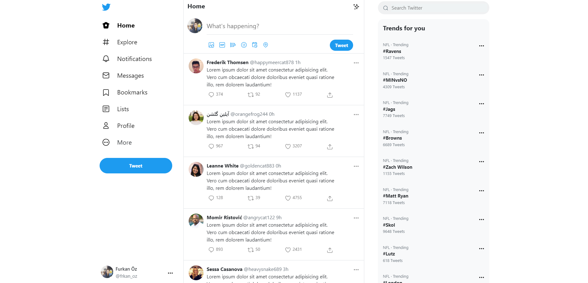
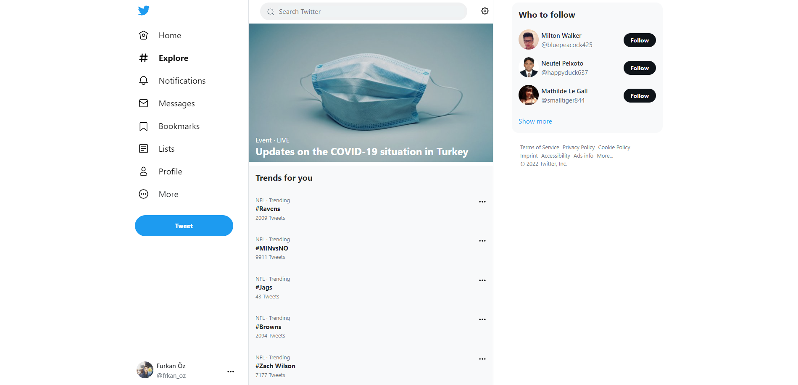
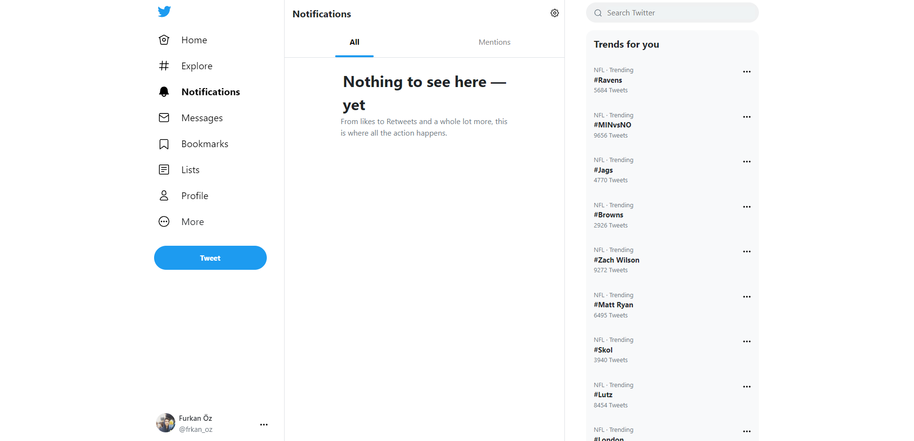
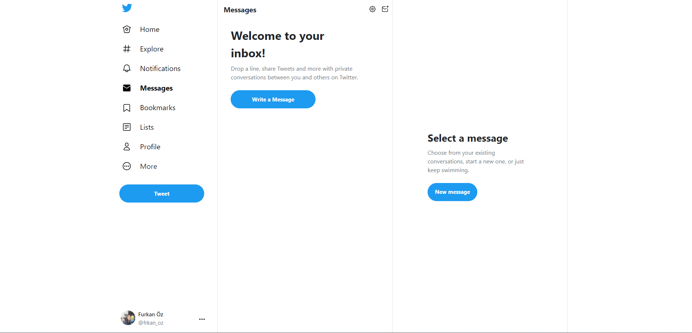
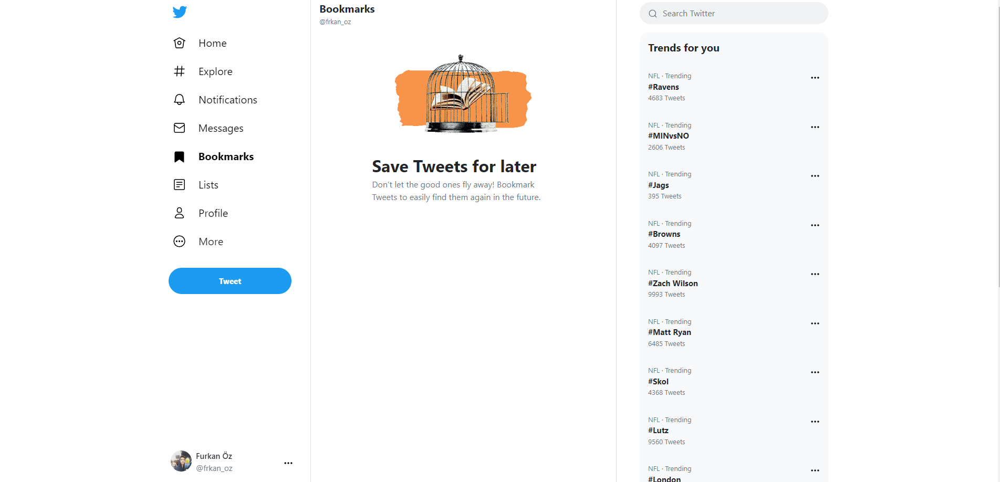
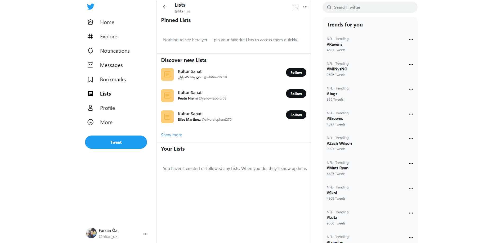
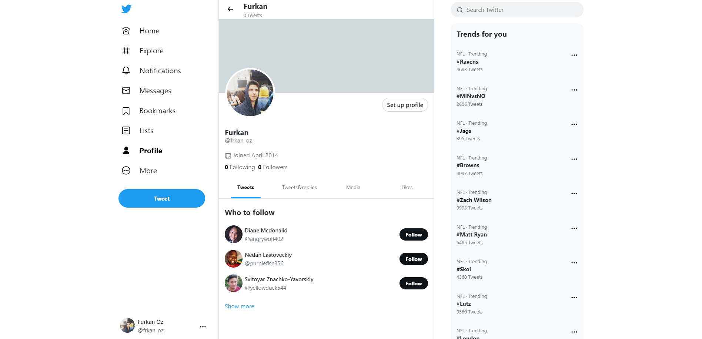

## Contributing

### Requirements

- Git
- Node.js 18 or higher
- npm

### Installation

1. Clone this repo

```bash
git clone https://github.com/furkan-oz/twitter-clone-reactjs.git
```

2. Go to the project directory

```bash
cd twitter-clone-reactjs
```

3. Install the dependencies

```bash
npm install
```

4. First, run the development server:

```bash
npm run start
```

5. Open [http://localhost:3000](http://localhost:3000) with your browser to see the result.

## Preview

<details>
  <summary>
    <b>Images</b>
  </summary>









</details>

## Learn More

You can learn more in the [Create React App documentation](https://facebook.github.io/create-react-app/docs/getting-started).

To learn React, check out the [React documentation](https://react.dev/).
